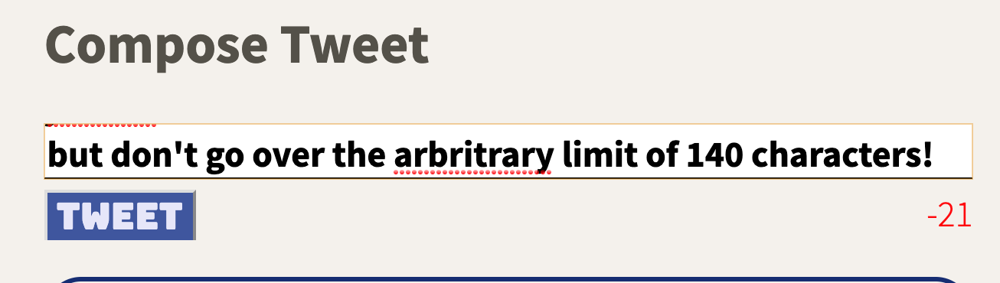

# Tweeter

A simple single-page Twitter clone using HTML, CSS, JS, JQuery and AJAX for front-end development. Node and Express were used in the backend to serve the contents. 

## Getting Started

1. Fork this repository, then clone your fork of this repository.
2. Install dependencies using the `npm install` command.
3. Start the web server using the `npm run local` command. The app will be served at <http://localhost:8080/>.
4. Go to <http://localhost:8080/> in your browser.

The web app will be supported by most common browsers (MS Edge, Firefox, and chrome).

## Views & Features

### Mobile View

The mobile version of the site is condensed to show the profile image and tweets in a linear fashion.

### Compose button

The compose button at the top right allows users to write a tweet which will be posted to the server.

### Counter

A real-time counter of the number of characters used is displayed on the bottom right. Users on desktop devices can use the 'enter' key to submit a tweet (and shift-enter to enter a new line).

### Over-limit

When a user goes over the limit the display will change, and users will be unable to submit a tweet.

### Jump up

If a user scrolls down far enough an icon will appear on the bottom right allowing users to scroll automatically to the top of the page and compose a tweet.

### Desktop View

In desktop view the profile image will display on the left-side of the screen. This view will trigger for an screen with a screenwidth greater than 1024 px.

## Dependencies
- Express
- Node 5.10.x or above
- Chance
- MD5

